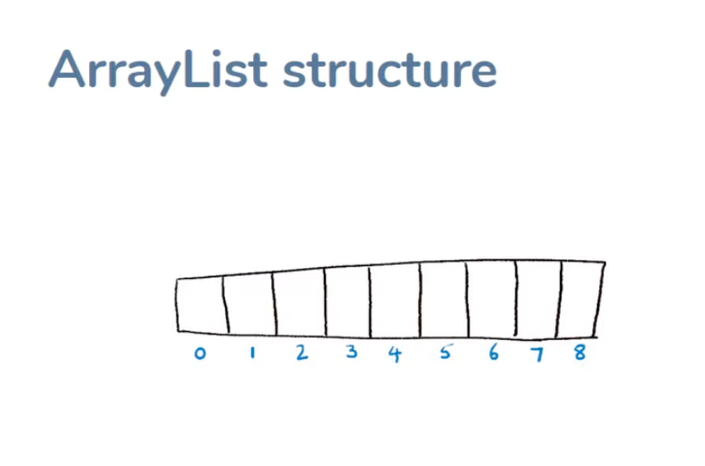

- [Collections](#collections)
  - [Defintion](#defintion)
  - [Agenda](#agenda)
    - [Concept](#concept)
      - [Collections](#collections-1)
    - [Roadmap](#roadmap)
  - [Pre-Collection API](#pre-collection-api)
    - [arrays](#arrays)
      - [work with primitive types and object references](#work-with-primitive-types-and-object-references)
      - [The problem with arrays](#the-problem-with-arrays)
      - [Arrays class](#arrays-class)
    - [Vector](#vector)
    - [Hashtable](#hashtable)
  - [The diffrent collection needs](#the-diffrent-collection-needs)
    - [Arrays and the Arrays class](#arrays-and-the-arrays-class)
    - [Position based access](#position-based-access)
    - [Uniqueness](#uniqueness)
    - [Retrieval mechanisms](#retrieval-mechanisms)
    - [Others](#others)
  - [Collection Types](#collection-types)
    - [Collections types](#collections-types)
    - [Implementations](#implementations)
    - [Examples](#examples)
  - [Hierarchy of Collections](#hierarchy-of-collections)
  - [ArrayList](#arraylist)
  - [O notation](#o-notation)
    - [Tradeoffs](#tradeoffs)
    - [Time Effieciency](#time-effieciency)
      - [How do you measure time efficiency?](#how-do-you-measure-time-efficiency)
      - [O(N)](#on)
        - [Linear Time](#linear-time)
        - [Constant Time](#constant-time)
        - [Logarithmic Time](#logarithmic-time)
        - [Quadratic Time](#quadratic-time)
        - [How O-Notation matters](#how-o-notation-matters)
  - [How iterators work?](#how-iterators-work)
    - [Feature](#feature)
    - [for each loop](#for-each-loop)
    - [Iterator vs Iterable](#iterator-vs-iterable)
      - [Iterator](#iterator)
      - [Iterable](#iterable)
    - [Example: ArrayList](#example-arraylist)
  - [Equality in OOP](#equality-in-oop)
  - [Hashing and hash codes](#hashing-and-hash-codes)
    - [The hashing concept](#the-hashing-concept)
    - [hashcode in java](#hashcode-in-java)
    - [does two object with the same hashcode equal?](#does-two-object-with-the-same-hashcode-equal)
    - [What is hashcode for?](#what-is-hashcode-for)
  - [Object ordering](#object-ordering)
    - [Comparison](#comparison)
    - [Comparable interface](#comparable-interface)
    - [why the return type is `int`?](#why-the-return-type-is-int)
    - [Return values](#return-values)
    - [Implementing the Comparable interface](#implementing-the-comparable-interface)
    - [sorting](#sorting)
    - [Custom comparators](#custom-comparators)
    - [Comparable vs Comparator](#comparable-vs-comparator)
    - [Sort method](#sort-method)
  - [Collection interface](#collection-interface)
    - [`Collections` vs `Collection` interface](#collections-vs-collection-interface)
      - [`Collections` is a static utility class](#collections-is-a-static-utility-class)
      - [`Collection` is an interface](#collection-is-an-interface)
    - [Lowest comman denominator](#lowest-comman-denominator)
      - [To support all collections](#to-support-all-collections)
      - [Implements the `Iterable` interface](#implements-the-iterable-interface)
    - [`Collection` is the root interface in the collection hierarchy.](#collection-is-the-root-interface-in-the-collection-hierarchy)
    - [No direct implementation in the JDK](#no-direct-implementation-in-the-jdk)
    - [Sub interfaces for collection types](#sub-interfaces-for-collection-types)
  - [List](#list)
    - [Common usecases](#common-usecases)
      - [Storing items in order with index based access](#storing-items-in-order-with-index-based-access)
    - [List interface](#list-interface)
      - [Add](#add)
      - [Remove](#remove)
      - [Replace](#replace)
      - [Inspect](#inspect)
      - [Retrieve](#retrieve)
      - [Process](#process)
  - [ArrayList](#arraylist-1)

# Collections 

## Defintion
* Language API to manage "groups" of things

## Agenda
* Understanding the overall Collection API
* Learning individual types of collections
* When to use what? What's the fifference?

### Concept
* Coding to interfaces
* Iterator pattern
* Efficency discussions
* Equality and hash code
* Natual ordering and comparisons

#### Collections
* Set
  * HashSet
  * TreeSet
* Lists
  * ArrayList
  * LinkedList
* Maps
  * HashMap

### Roadmap
* Pre-Collection API
* Diffent Collection needs
* Introducing ArrayList
* Concepts and fundamentals
* Zoom up to Collections interface
* Tackle individual collections types
* Lear the collection type, usages and code examples
  


## Pre-Collection API
### arrays
```java
int[] numbers;
numbers = new int[10];
numbers[0] = 1;
System.out.println(numbers[0]);
```
#### work with primitive types and object references
```java
Date[] dates = new Date[10];
dates[0] = new Date();
```
#### The problem with arrays
```java
* Limited data structure
* Does not have methods on its own
* Have to use `Arrays` class to do things
```
#### Arrays class
* `Arrays.asList()`
* `Arrays.compare()`
* `Arrays.copyOf()`
```java
// String[] names = {"John", "Jane", "Joe"};
String[] names = new String[10];
Arrays.fill(names, "name ");
for(int i = 0; i < names.length; i++) {
  names[i] = names[i] + i;
}
Arrays.binarySearch(names, "name 4");
```
### Vector
### Hashtable

## The diffrent collection needs
### Arrays and the Arrays class
  * Isn't that enough?
### Position based access
  * Strorage and retrieval by index
  * Needs sorting methods
  * Ordered vs Unordered
### Uniqueness
  * Are duplicates allowed?
  * Affects adding behavior
  * No need for position based access
### Retrieval mechanisms
  * Index based retrieval
  * Key based retrieval
  * Presence-only retrieval
### Others
  * Mutability
  * Concurrency requirements

## Collection Types
### Collections types
* Define the contract of the collection
  * List
  * Set
  * Map Queue
### Implementations
* How it acturally works behind the scenes
### Examples
* #### List
  * Defines the contract/behavior
* ##### ArrayList
  * An implementation of List contract
* ##### LinkedList
  * Another implementation of List contract
* #### Set
  * HashSet
  * LinkedHashSet
  * TreeSet
* Q
* #### Map
  * HashMap
  * TreeMap
* #### Queue
  * PriorityQueue
* #### Tradeoffs
  * finding what is the right tool for the job

## Hierarchy of Collections

  
https://github.com/seaboyz/coding-interview/blob/990a49ddc8d6e9c2b4744faa95eecc8ec95f158e/Sanbox/src/App.java#L6

## ArrayList
* "Replacement" for arrays

```java
ArrayList<String> names = new ArrayList<>();
for(int i = 0; i < 20; i++){
    names.add("name " + i);
}
for(int i = 0; i < 20; i++){
    System.out.println(names.get(i));
}
```

## O notation
### Tradeoffs
* Feature requirements
* Efficiency
  * Time
  * Space
    * Usualy proportional to size to be stored.

### Time Effieciency
  * How long does it take?
  * Storage time - single item
  * Retrieval time - sigle item
  * Retrival time - search
#### How do you measure time efficiency?
* Bigger collecion = longer times
* A factor of N (number of elements)
#### O(N)
* Big O notation
* How good / bad is the depencency on N?
* Rough imprecise measurement/classification
* Broad buckets
* it assumes the worst case estimate
* Rough/board estimate

##### Linear Time
* O(N) - depends on number of elements

##### Constant Time
* O(1)

##### Logarithmic Time
* O(log N) 
* Binary search
  1. Look at the middle
  2. if greater, take first half
  3. if lesser, take second half
  4. Repeat
* has to be sorted first
* Time doesn't linearly increase with size of N

##### Quadratic Time
* find duplecated element
* O(N<sup>2</sup>)

##### How O-Notation matters
* Inherent performance characteristics
  * Search a list(not sorted)
* Implementation-based characteristics
  * Looking up by index(ArrayList vs LinkedList)
* Underlying factor

## How iterators work?
### Feature
* each iterator has its own state(every time you get a iterator form .iterator(), it returns a new iterator)
* iterator does not like the collection to be modified

### for each loop
```java
for(String name : names){
    System.out.println(name);
}
```
### Iterator vs Iterable
#### Iterator
```java
public interface Iterator<E> {
  boolean hasNext();// Are there more elements?
  E next();// Get the next element in the iteration
  void remove();// Remove the last element returned by iterator
  default void forEachRemaining(Consumer<? super E> action) 
}
```
#### Iterable
```java
public interface Iterable<E> {
  Iterator<E> iterator();
  default Spliterator<E> spliterator() {
    return Spliterators.spliteratorUnknownSize(iterator(), 0);
  }
  default void forEach(Consumer<? super E> action) {
    Objects.requireNonNull(action);
    Spliterator<E> spliterator = spliterator();
    while (spliterator.tryAdvance(action)) {
      // Empty
    }
  }
}
```

### Example: ArrayList
```java
ArrayList<String> names = new ArrayList<>();
for(int i = 0; i < 20; i++){
    names.add("name " + i);
}
Iterator<String> iterator = names.iterator();
// String element = iterator.next();

while(iterator.hasNext()){
    element = iterator.next();
    System.out.println(element);
}
```

## Equality in OOP
* `==`
* `equals()`
* Equality with objects(You have to define it)
* Only you know what equivalence means
* The `equals()` method is used to compare objects
* The `==` operator is used to compare references
```java
public class Students {
  private String name;
  private int age;
  public Students(String name, int age){
    this.name = name;
    this.age = age;
  }
  public String getName(){
    return name;
  }
  public int getAge(){
    return age;
  }
  public boolean equals(Object o){
    if(o == null){
      return false;
    }
    if(o == this){
      return true;
    }
    if(!(o instanceof Students)){
      return false;
    }
    Students s = (Students) o;
    return s.getName().equals(this.getName()) && s.getAge() == this.getAge();
  }
  public int hashCode(){
    return Objects.hash(name, age);
  }
}
```

## Hashing and hash codes
### The hashing concept
* using hash function to convert a object to a string value
  
  
* hash mapping is not one-to-one, it is one-to-many, but it could be one
  
### hashcode in java
```java
public int hashCode(){
  return Objects.hash(name, age);
}
```
### does two object with the same hashcode equal?
* No.
* It dependes the implementation of `equals()`

### What is hashcode for?
*The purpose of the hashCode() method is to provide a numeric representation of an object's contents so as to provide an alternate mechanism to loosely identify it. By default the hashCode() returns an integer that represents the internal memory address of the object

## Object ordering
### Comparison
* what to compare?
* there is object state in two objects
* there is a clear definition of comparison of those values
* Individual values or combination of values
* not all objects are comparable 
  * two database connection instances are not comparable
* comparison is not defaut
  
### Comparable interface
  * Indicates that an object is comparable
``` java
public interface Comparable<T>{
  public int compareTo(T o);
}
```
### why the return type is `int`?
* Argument object is greater than this object
* Argument object is lesser than this object
* They are both the same(things that are compared are same)
   
### Return values
* Negative value
  * object `o` is greater than `this` object.
* Positive value
  * object `o` is lesser than `this` object.
* Zero 
  * they are both the same.

### Implementing the Comparable interface
```java
public class Student implements Comparable<Student> {

  @Override
  public int compareTo(Student o){
    if(this.id > o.getId()){
      return 1;
    }
    if(this.id < o.getId()>){
      return -1;
    }
    return 0;
  }

  // another way
  public int compareTo(Student o){
    return this.id - o.getId();
  }

}
```

### sorting
```java
Student s1 = new Student(1,"john","doe","science");
Student s1 = new Student(2,"tom","cat","history");
Student s1 = new Student(3,"jane","doe","arts");
ArrayList<Student> students = new ArrayList<>();
students.add(student1);
students.add(student2);
students.add(student3);

students.sort(null);
```
https://github.com/seaboyz/java-collection/blob/1483adbbbf89aeb3e4b26770065c8edd9d2f3d15/Sanbox/src/Student.java#L14

### Custom comparators
* By cource enrollment
* But this is only one `compareTo()` method
* Compartor here to sovle the problem

### Comparable vs Comparator
* Comparable 
  * means I am a object that can be compared
  * please compare me to other objects
* Comparator
  * for creating the object instance for `Comparable` to use
```java
public interface Comparator<T>{
  public int compare(T o1, T o2);
}
```
```java
import java.util.Comparator;

public class StudentLastNameComparator implements Comparator<Student> {
    @Override
    public int compare(Student s1, Student s2) {
        return s1.getLastname().compareTo(s2.getLastname());
    }
}
```

### Sort method
* Tkes comparator instance as argument
```java
students.sort(new StudentLastNameComparator());
```

## Collection interface

* `Map` interface is not inherited from the `Collection` interface

### `Collections` vs `Collection` interface
#### `Collections` is a static utility class
```java
Collections.sort(students, new StudentLastNameComparator());
```
#### `Collection` is an interface
```java
public interface Collection<E>{
  public int size();
  public boolean isEmpty();
  public boolean contains(Object o);
  public Iterator<E> iterator();
  public Object[] toArray();
  public <T> T[] toArray(T[] a);
  public boolean add(E e);
  public boolean remove(Object o);
  public boolean containsAll(Collection<?> c);
  public boolean addAll(Collection<? extends E> c);
  public boolean removeAll(Collection<?> c);
  public boolean retainAll(Collection<?> c);
  public void clear();
}
```
### Lowest comman denominator
#### To support all collections
#### Implements the `Iterable` interface
```java
Interface Queue<E> extends Collection<E>{
  public boolean offer(E e);
  public E poll();
  public E peek();
}
Interface List<E> extends Collection<E>{
  public E get(int index);
  public E set(int index, E element);
  public void add(int index, E element);
  public E remove(int index);
  public int indexOf(Object o);
  public int lastIndexOf(Object o);
  public ListIterator<E> listIterator();
  public ListIterator<E> listIterator(int index);
  public List<E> subList(int fromIndex, int toIndex);
}
Interface Set<E> extends Collection<E>{
  public boolean add(E e);
  public boolean remove(Object o);
  public boolean containsAll(Collection<?> c);
  public boolean addAll(Collection<? extends E> c);
  public boolean removeAll(Collection<?> c);
  public boolean retainAll(Collection<?> c);
  public void clear();
}
```

### `Collection` is the root interface in the collection hierarchy.
* Add
  * add()
  * addAll()
* Remove
  * remove()
  * removeAll()
  * retainAll()
  * clear()
* Inspect
  * isEmpty()
  * size()
* Process
  * iterator()
  * stream()
  * toArray()
  * 
### No direct implementation in the JDK

### Sub interfaces for collection types 
* Set
* List
* Queue

## List
* An ***ordered*** collection of elements

### Common usecases
#### Storing items in order with index based access
* List of students in the school
* List of students with IDs
  * Add (enroll) new students
  * Process all students in order
    * By ID for sending notifications
    * By name for attendance
    * By grade for scholarships
  * Access a student's record given ID
### List interface
#### Add
```java
boolean add(E e);
boolean AddAll(Collection<? extends E> c);
void add(int index, E element);
boolean addAll(int index, Collection<? extends E> c);
```
#### Remove
```java
E remove(int index);
boolean remove(Object o);
boolean removeAll(Collection<?> c);
boolean retainAll(Collection<?> c);
void clear();
```
#### Replace
```java
E set(int index, E element);
default void replaceAll(UnaryOperator<E> operator);
```
#### Inspect
```java
boolean isEmpty();
int size();
boolean contains(Object o);
boolean containsAll(Collection<?> c);
int indexOf(Object o);
int lastIndexOf(Object o);
```
#### Retrieve
```java
E get(int index);
// returns a view of the portion of this list between the specified fromIndex, inclusive, and toIndex, exclusive.
List<E> subList(int fromIndex, int toIndex);
```
#### Process
```java
Iterator<E> iterator();
ListIterator<E> listIterator();
ListIterator<E> listIterator(int index);
default Spliterator<E> spliterator();
```

## ArrayList
* A list that is implemented as an array
* The array is resized automatically when the list grows
* The array is resized automatically when the list shrinks
* The array is resized automatically when the list is cleared
```java
ArrayList<E> arrayList = new ArrayList<>();
```
 


